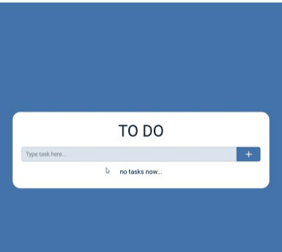

# TO DO SPA

#### приложение для создания списка задач прямо в браузере


установка зависимостей
```js
npm instal
```

запуск и старт проекта
```js
npm run dev
```

проект открывается локально по ссылке
```js
http://localhost:5173/
```

- сборка проекта проекта выполнена [Vite](https://vitejs.dev/guide/)
- проект написан на [TypeScript](https://www.typescriptlang.org/)
- в проекте использован стейт-мендежер [Zustand](https://github.com/pmndrs/zustand)
- сохранение данных выполняется локально в браузере при помощи localStorage
- выполнена адаптивная вёрстка под разные экраны устройств

открыть приложение можно по [ссылке](https://pyctam-ac.github.io/to_do_spa/)


